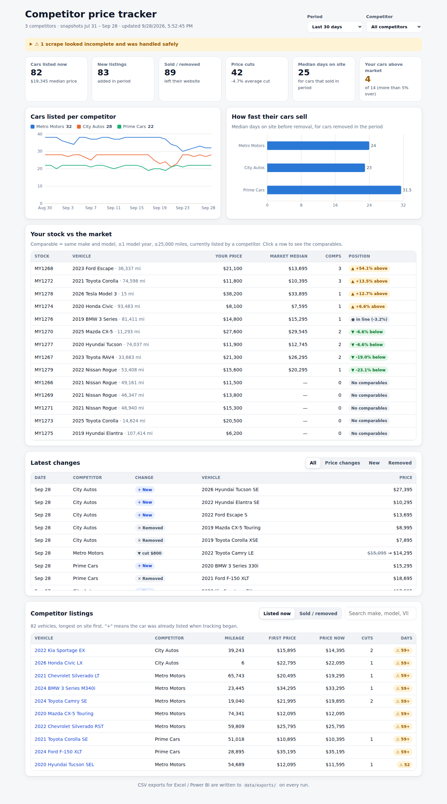
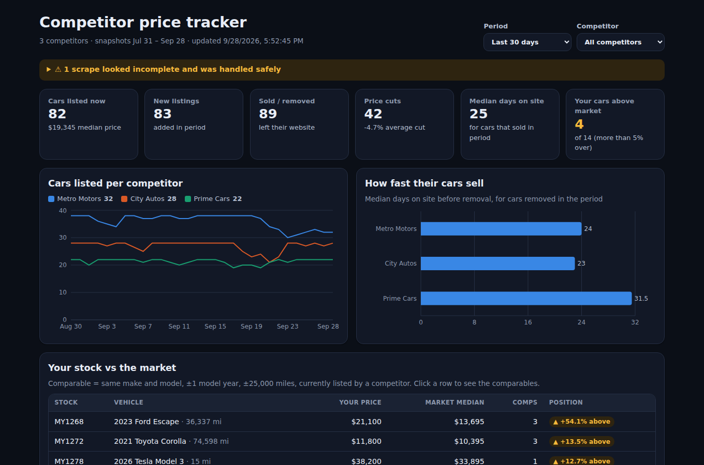
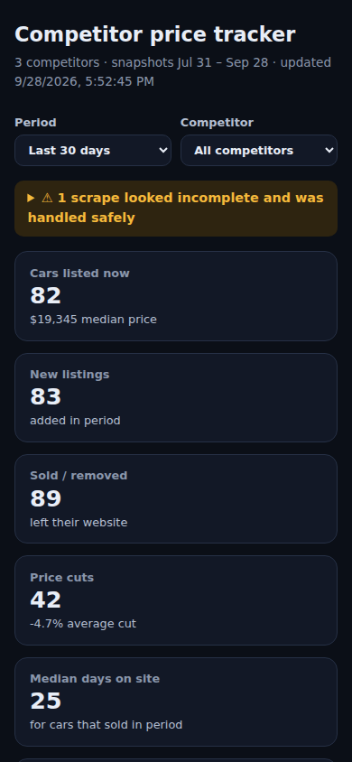

# Competitor Price Tracker for car dealers

Watches competitor dealer websites every day and answers the questions dealers pay for:

- **What did they add, sell and discount this week?** A change feed of new listings, price cuts and raises, removed (sold) cars, and relists.
- **How fast do their cars sell?** Days on site per car, and the median per competitor.
- **Am I priced right?** Each of your cars is compared with competitors' listings of the same make and model, ±1 year and ±25k miles, with the market median and how far above or below it you are.
- **Excel / Power BI exports** (`data/exports/*.csv`) on every run.



| Dark mode | Phone |
|---|---|
|  |  |

## How it works

```
config/competitors.json ──► scraper ──► data/snapshots/<date>/<dealer>.json ──► change detection ──► public/data/history.json ──► dashboard
                                                                                                  └─► data/exports/*.csv
```

1. **Scraper** (`src/scraper`). For each competitor it:
   - reads `robots.txt` and never fetches a disallowed page; it honours `Crawl-delay` and waits between requests (default 3 s);
   - follows "next page" links with a loop guard and a page cap, and retries server errors with back-off;
   - extracts vehicles from **schema.org JSON-LD** (Car / Vehicle / Product, ItemList, `@graph`), which most dealer website platforms publish. Sites without it use **CSS selectors** you set per site;
   - normalises prices (`$23,995`, `PKR 4,250,000`, `£12.5k`), mileage, VIN, year, make and model, and strips tracking parameters from URLs. Each car is identified by its VIN, or by its URL when there's no VIN.
2. **Change detection** (`src/core/history.ts`) replays the daily snapshots. It protects against the classic scraping mistake of reading a broken page as a sell-out:
   - a scrape that returns nothing, or suddenly 60%+ fewer cars, is **skipped**;
   - a scrape where any page failed still records new cars and price changes, but **doesn't mark missing cars as sold**;
   - cars present on the very first scrape aren't counted as "new", and their age is shown as "N+ days".
3. **Dashboard** (`src/web`) is a static React app that reads `history.json`, so it can be hosted anywhere, including GitHub Pages.

## Try it (no internet needed)

```bash
npm install
npm run demo     # runs the real scraper against 3 simulated dealer sites for 60 days
npm run dev      # open the dashboard
```

The demo sites cover the three formats you'll meet in practice: a JSON-LD ItemList with paginated pages, plain HTML cards (CSS selectors) with pagination, and a JSON-LD `@graph` page that includes a broken JSON block. One site is "down" on day 37 to show the failure handling.

## Track real competitors

1. Copy `config/competitors.example.json` to `config/competitors.json` and add each dealer's inventory URL.
   - Try `"mode": "auto"` first; most dealer sites publish JSON-LD.
   - If you get 0 vehicles, open the page, inspect a car card, and add `selectors` (`card`, `title`, `price`, plus optional `link`, `mileage`, `vin`, `stockNo`; use `selector@attr` to read an attribute). Set `nextPage` to the "next" link's selector.
2. Optionally add your own stock as `config/my-inventory.csv` with columns `StockNo,Year,Make,Model,Mileage,Price`.
3. Run `npm run scrape` once a day. The included **Daily scrape** GitHub Action does this automatically once `config/competitors.json` exists, and commits the results.
4. `npm run report` rebuilds the dashboard data and CSVs from saved snapshots.

**Be a good citizen:** only track public listing pages, keep the delay at 2–3 s or more, and respect each site's terms of use. The scraper identifies itself with a descriptive User-Agent and obeys `robots.txt`. Sites that load their inventory with JavaScript only (no JSON-LD, empty HTML) need a headless browser, which this version doesn't include.

## Commands

| Command | What it does |
|---|---|
| `npm run demo` | Simulated 60-day run (rewrites `data/` and `public/data/`) |
| `npm run scrape` | Scrape configured competitors for today and rebuild the report |
| `npm run report` | Rebuild the report from existing snapshots |
| `npm run dev` / `npm run build` | Dashboard dev server / production build |
| `npm test` | Unit and integration tests (the scraper is checked car by car against simulated sites) |
| `npm run smoke` | Browser test of the built dashboard (desktop, phone, dark mode) |

## Deploy
This repo is private, and GitHub Pages for private repos needs a paid GitHub plan, so the Pages workflow runs **only when started by hand**. To publish:
1. Make the repo public (or upgrade your plan).
2. Settings → Pages → Source: **GitHub Actions**.
3. Actions → **Deploy…** → Run workflow.

Or deploy anywhere static for free (Netlify, Vercel, Cloudflare Pages): build it and upload the output folder.
